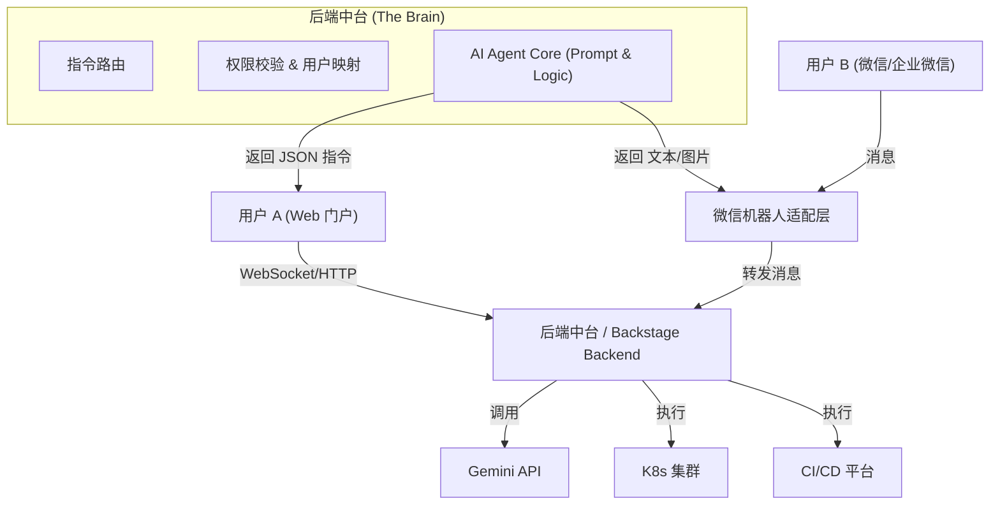
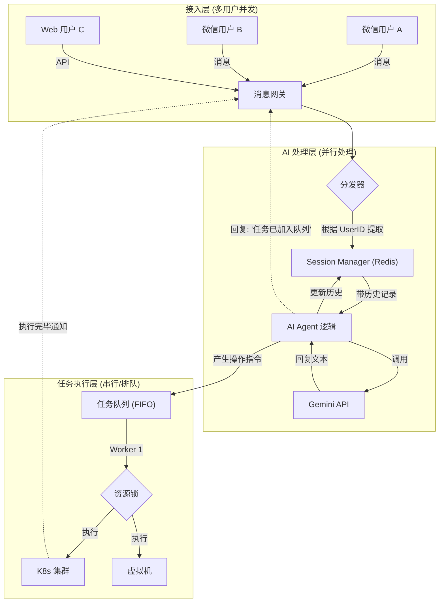

# **智维领航 (SmartOps) \- 微信集成架构设计**

为了实现“微信聊天 \= 门户 AI 对话”的效果，我们需要将当前的**前端直连 LLM** 模式改造为 **后端 Agent 中心** 模式。

## **1\. 核心架构变更**

目前的架构是：

用户 (浏览器) \-\> React App (包含 AI 逻辑) \-\> Gemini API

未来的架构应该是：




## **2\. 具体的改进点 (改造清单)**

### **A. 逻辑层下沉 ("Headless" AI)**

**现状**：AI 的提示词 (SYSTEM\_INSTRUCTION) 和标签解析逻辑 ({{NAV:K8S}}) 都在前端 AI\_Ops\_Portal.tsx 里。

**改进**：

1. 建立一个 **Node.js/Python 后端服务**。  
2. 将 callGemini 和 Prompt 逻辑移入后端。  
3. **统一接口**：后端暴露一个 API POST /api/chat，接受 { userId, message, platform }。  
   * Web 端调用时，platform='web'。  
   * 微信端调用时，platform='wechat'。

### **B. 接入层建设 (WeChat Adapter)**

由于微信个人号限制，建议采用以下两种方案之一：

* **方案一：企业微信 (WeCom) \- 推荐/稳定**  
  * 使用企业微信官方 API 创建一个“自建应用”。  
  * 配置简单，官方支持，更适合运维场景（可以直接发卡片消息、审批请求）。  
  * 安全性高，自带组织架构。  
* **方案二：开源 Bot 框架 (Wechaty/Gewechat) \- 极客/个人**  
  * 使用 [Wechaty](https://wechaty.js.org/) (Node.js) 挂载到你的个人微信号上。  
  * 优点：体验最原生，就像和朋友聊天。  
  * 缺点：协议可能不稳定，有封号风险。

### **C. 响应适配 (Response Adapter)**

这是最关键的用户体验差异点。

* **Web 端**：  
  * 后端返回：{ text: "好的...", action: "NAV:K8S", data: { ...nodes } }  
  * 前端行为：渲染 React 组件（漂亮的仪表盘、拓扑图）。  
* **微信端**：  
  * 后端返回：同上。  
  * **适配层行为**：  
    1. **文字**：直接转发 text。  
    2. **动作转换**：  
       * 如果是 NAV:K8S：微信无法渲染 React 组件。适配器需要调用 **Puppeteer** 截图，或者生成一个**文本摘要**发送给微信。  
       * *例子*："集群状态概览：
         * ✅ Control Plane: Ready
         * ❌ Worker-3: NotReady (CPU 0%)
    3. **审批**：  
       * 如果是 REQ:APPROVAL：发送一个带链接的消息，或者回复 "同意/拒绝" 来触发后续 API。

### **D. 安全与鉴权 (Security)**

* **白名单机制**：在适配层做一个映射表 WeChat_ID <-> Ops_Role。只有白名单里的微信 ID 发送的消息才会被转发给 AI Agent。  
* **敏感操作二次确认**：在微信上执行重启、删除操作时，强制要求回复特定验证码或点击企业微信的审批按钮。

## **3\. 代码模拟示例 (Node.js Wechaty)**

假设你使用 Wechaty 作为适配层，代码可能长这样：
```javascript
// wechat-bot.js  
import { WechatyBuilder } from 'wechaty'

const bot = WechatyBuilder.build()  
const ADMIN_ID = 'wxid_your_id'; // 白名单

bot.on('message', async msg => {  
  const sender = msg.talker()  
  const text = msg.text()

  // 1. 安全拦截  
  if (sender.id !== ADMIN_ID) return;

  // 2. 转发给后端大脑 (你现在的 AI 逻辑移到了这里)  
  const aiResponse = await callOpsBackend({  
    user: sender.name(),  
    message: text  
  });

  // 3. 适配回复  
  await msg.say(aiResponse.text); // 发送 AI 的文本回复

  // 4. 处理特殊指令 (例如查看 K8s)  
  if (aiResponse.action === 'NAV:K8S') {  
     // 生成简报而不是跳转 Web  
     const summary = generateK8sTextSummary(aiResponse.data);  
     await msg.say(summary);   
     // 或者发送 Web 门户的深度链接  
     await msg.say(`查看详细图表请点击: https://ops-portal.internal/k8s?token=...`);  
  }  
});

bot.start();
```
## **4\. 总结**

要在微信上实现同样的效果，核心不在于修改现在的 React 代码，而在于**建立一个共享的后端 AI 服务**。

1. **React App** 变成该服务的 **富客户端 (Rich Client)**。  
2. **微信 Bot** 变成该服务的 **瘦客户端 (Thin Client)**。