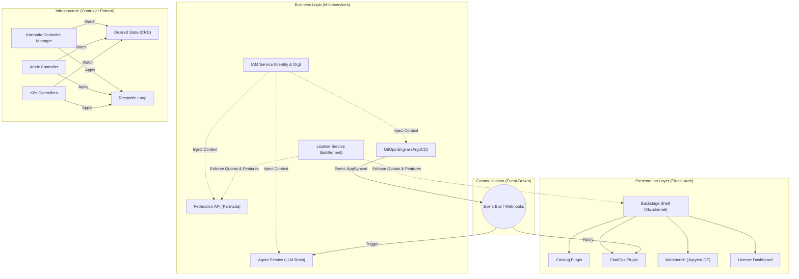

```mermaid
graph TD
    subgraph "Presentation Layer (Plugin Arch)"
        A["Backstage Shell (Microkernel)"]
        A1[Catalog Plugin]
        A2[ChatOps Plugin]
        A3["Workbench (Jupyter/IDE)"]
        A4["License Dashboard"]
        A --> A1 & A2 & A3 & A4
    end

    subgraph "Business Logic (Microservices)"
        B1["IAM Service (Identity & Org)"]
        B2["Agent Service (LLM Brain)"]
        B3["Federation API (Karmada)"]
        B4["GitOps Engine (ArgoCD)"]
        B5["License Service (Entitlement)"]
        
        %% Identity & License Flow
        B1 -. "Inject Context" .-> B2 & B3 & B4
        B5 -. "Enforce Quotas & Features" .-> B3 & A
    end

    subgraph "Communication (Event-Driven)"
        Bus(("Event Bus / Webhooks"))
        B4 --"Event: AppSynced"--> Bus
        Bus --"Trigger"--> B2
        Bus --"Notify"--> A2
    end

    subgraph "Infrastructure (Controller Pattern)"
        C1[Karmada Controller Manager]
        C2[Aibrix Controller]
        C3[K8s Controllers]
        State["Desired State (CRD)"]
        Loop[Reconcile Loop]
        C1 & C2 & C3 --"Watch"--> State
        C1 & C2 & C3 --"Apply"--> Loop
    end
```