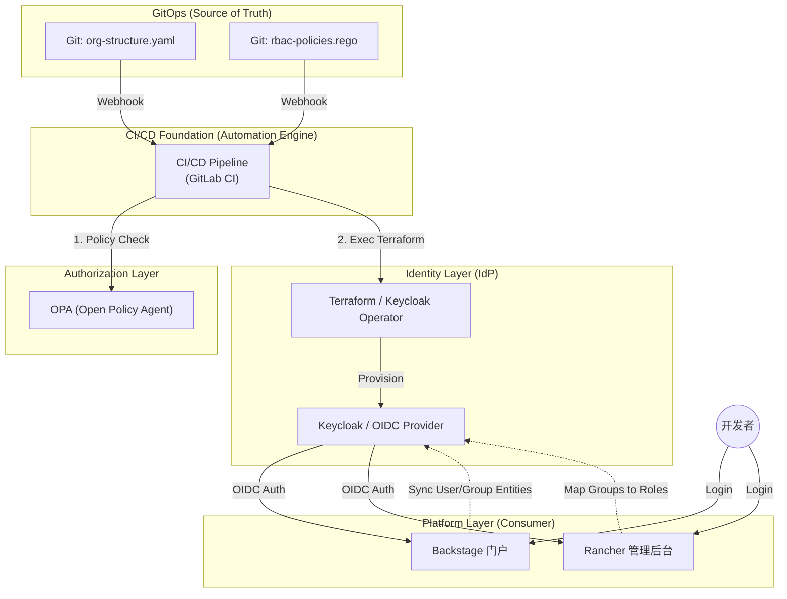
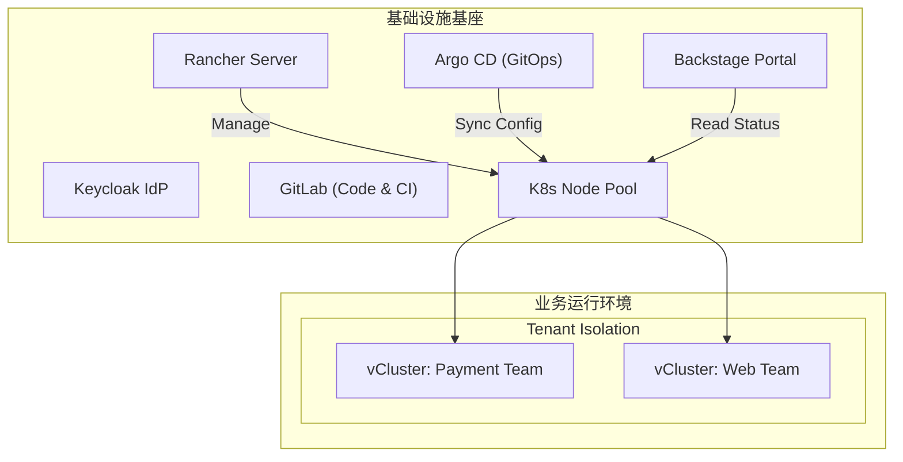

# **云原生多租户平台身份架构设计方案 (Phase 1\)**

**版本**: V2.4 (含实操脚本)

**核心目标**: 建立以身份为边界的零信任基座，实现“组织架构即代码”。

## **1\. 核心设计哲学 (Future Trends)**

在传统架构中，用户管理往往是分散在各个系统中的“运维黑洞”。面向未来的设计遵循以下三个原则：

1. **Identity as Code (IaC)**: 组织架构（部门、团队、人员）不是在管理后台手动点击创建的，而是定义在 Git 仓库中的 YAML 文件里。  
2. **Single Source of Truth (SSOT)**: 身份提供商 (IdP) 是唯一的真理来源。Backstage 和 Rancher 只是身份的“消费者”，严禁在这些平台本地创建用户。  
3. **Federated Trust (联邦信任)**: 平台组件之间通过标准协议 (OIDC) 传递信任，而非共享密码或密钥。

### **1.1 操作模式对比：传统 vs. 现代**

为了解答“是否需要建表”和“如何操作”的疑问，我们对比两种模式：

| 特性 | 传统模式 (Database-Centric) | 现代模式 (Identity-as-Code) |
| :---- | :---- | :---- |
| **用户表结构** | **需要**。开发者在业务库设计 users 表 (含密码、盐值)。 | **不需要**。Keycloak 接管存储。业务库仅存 user\_uuid 做关联。 |
| **管理员操作** | **GUI/SQL**。登录管理后台点击“新增用户”或直接改库。 | **Git 操作**。提交 YAML 文件变更 (Merge Request)。 |
| **生效方式** | 立即生效 (无审计，易误操作)。 | **流水线执行**。经 Code Review 后，CI/CD 自动同步。 |
| **多环境同步** | **痛苦**。Dev/Test/Prod 需要手动重复创建 3 次。 | **自动**。一份配置，通过流水线分发到所有环境。 |
| **安全性** | 密码散列逻辑由开发者实现，风险高。 | 密码由专业 IdP (Keycloak) 托管，支持 MFA/指纹。 |


## **2\. 架构全景图 (逻辑视图)**

### **2.1 基础设施部署拓扑 (物理视图)**

为了回答“组件跑在哪里”的问题，我们推荐采用 **管理集群 (Management Cluster)** 与 **工作负载集群 (Workload Cluster)** 分离的模式：



**关键点解析：**

1. **Keycloak & Rancher**: 部署在独立的**管理集群**中。即使业务集群（Workload Cluster）挂了，管理员依然可以通过 Rancher 和 Argo CD 进行修复，身份认证（Keycloak）也不受影响。  
2. **GitLab & Argo CD**: 同样部署在管理集群，作为“控制平面”的一部分，负责向业务集群下发配置。  
3. **vCluster**: 运行在工作负载集群中，作为租户的实际运行环境。

## **3\. 详细实施方案**

### **3.1 身份源建设 (Identity Provider)**

我们不直接使用 LDAP，而是构建一个基于 **OIDC (OpenID Connect)** 的现代身份层。

* **选型**: Keycloak (开源、云原生友好、支持 Kubernetes Operator)。  
* **组织模型映射**:  
  * **Realm**: CloudPlatform (顶层隔离域)  
  * **Groups**: 对应公司的组织架构。  
    * /Engineering/Backend/Team-Payment  
    * /Engineering/Frontend/Team-Web  
  * **Roles**: 定义功能性角色。  
    * platform-admin (平台运维)  
    * tenant-admin (租户管理员)  
    * developer (普通开发者)

### **3.2 身份即代码 (Identity as Code) 流程**

这是最符合“未来方向”的一步。不要手动在 Keycloak 里加人。

1. **定义文件 (org.yaml)**:  

```yaml
teams:
  - name: payment-team
    members: [ "alice", "bob" ]
    roles: [ "tenant-admin" ]
    quota: "large"
```

2. **自动化同步**:  
   * 使用 Terraform Keycloak Provider 或编写简单的 Operator。  
   * 当 Git 代码合并后，自动在 Keycloak 中创建对应的 Group 和 User，并绑定 Role。

### **3.3 Backstage 侧的集成 (The Portal)**

Backstage 需要能够感知到“我属于哪个团队”，以便展示该团队的资源。

* **认证**: 使用 @backstage/plugin-auth-backend 的 OIDC Provider 连接 Keycloak。  
* **目录同步 (Catalog Ingestion)**:  
  * **方案**: 配置 KeycloakOrgEntityProvider (或通用 LDAP/OIDC Processor)。  
  * **效果**: Keycloak 中的 Group 会自动同步为 Backstage 中的 Group 实体；Keycloak 中的 User 同步为 User 实体。  
  * **所有权 (Ownership)**: 当用户登录 Backstage，系统自动识别其所属 Group (如 payment-team)。

### **3.4 Rancher 侧的集成 (The Enforcer)**

Rancher 需要信任 Backstage 传递过来的身份，或者支持同样的登录方式。

* **配置**: 在 Rancher \-\> Auth Provider 中配置 Generic OIDC，指向同一个 Keycloak。  
* **关键参数**:  
  * Group Claim: groups (确保 Keycloak Token 里携带组信息)。  
  * User Info: preferred\_username 或 email。

## **4\. 权限模型设计 (RBAC Strategy)**

这是为第二阶段（vCluster 划分）做铺垫的关键。我们需要定义**三层权限模型**：

| 层级 | 身份 (Backstage/IdP) | Rancher 角色映射 | 资源权限范围 |
| :---- | :---- | :---- | :---- |
| **L0: 平台管理员** | Group: platform-ops | **Cluster Admin** (Host Cluster) | 管理物理节点、所有 vCluster、全局配置 |
| **L1: 租户管理员** | Group: team-leaders | **Cluster Admin** (vCluster) | **关键点**: 只对自己团队的 vCluster 拥有完全控制权，无法访问宿主机 |
| **L2: 普通开发者** | Group: developers | **Edit/View** (vCluster) | 在 vCluster 内部署应用、查看日志，无法修改集群配置 |

## **5\. 落地步骤建议**

1. **部署 Keycloak**：在 Kubernetes 中部署 Keycloak，配置 Postgres 存储。  
2. **打通 Rancher**：配置 Rancher 对接 Keycloak OIDC，验证“使用 Keycloak 账号登录 Rancher”是否成功，且能正确识别 Group。  
3. **打通 Backstage**：配置 auth-backend 和 catalog-backend，验证 Backstage 是否能看到 User 和 Group 实体自动出现。  
4. **验证组映射**：  
   * 在 Keycloak 创建一个组 demo-group。  
   * 在 Rancher 中创建一个测试 Project，并添加成员 \-\> 选择 demo-group。  
   * 验证组内用户登录后是否自动获得权限。

## **6\. 未来扩展性 (Phase 2 预告)**

当身份和组建好后，第二阶段的“自动化创建 vCluster”将变得非常简单：

* 用户在 Backstage 填写表单：“我是 **Payment Team**，我要申请环境”。  
* Backstage 读取用户的 **Group 实体**。  
* 自动化脚本调用 Rancher/Helm 创建 vCluster。  
* **自动化脚本做最重要的一步**：创建 RoleBinding，将 **Keycloak Group: Payment Team** 绑定为 **vCluster: Admin**。

这样，新环境创建出来的瞬间，整个团队的人自动就有了权限，无需人工干预。

## **7\. CI/CD 实施方案推荐**

为了实现上述的自动化，我们推荐采用 **GitLab CI** 作为核心引擎，配合 **Terraform** 进行状态管理。

### **7.1 选型理由 (Why GitLab CI?)**

鉴于您计划在平台中集成 GitLab 代码仓库，直接使用 GitLab CI 是最优解：

* **一体化体验**: 代码与流水线同源，无需维护额外的 Jenkins Master。  
* **IaC 友好**: 拥有强大的 State 管理后端（可直接存储 Terraform State）。  
* **权限复用**: 谁能修改 org.yaml，谁能触发部署，完全由 GitLab 的 Merge Request 权限控制。

### **7.2 身份管理流水线设计 (The Identity Pipeline)**

当有人修改了 Git 仓库中的 org-structure.yaml 时，流水线应按以下步骤执行：

1. **Lint & Validate (校验阶段)**:  
   * 检查 YAML 语法错误。  
   * 确保必填字段（如 email, role）存在。  
2. **Policy Check (合规检查 \- 关键)**:  
   * **工具**: OPA (Open Policy Agent) 或 Conftest。  
   * **目的**: 防止越权。例如：*“检测到有人试图将自己加入 platform-admin 组，但提交者不是 CTO，阻断执行并报警。”*  
3. **Plan (预览阶段)**:  
   * 执行 terraform plan。  
   * 将变更预览（例如：+ create user: alice, \~ update group: payment）输出到 Merge Request 的评论区，等待人工 Review。  
4. **Apply (生效阶段)**:  
   * **触发条件**: 仅当代码合并到 main 分支后自动触发。  
   * 执行 terraform apply。  
   * 调用 Keycloak API 完成真实的用户创建和角色绑定。

### **7.3 示例代码 (.gitlab-ci.yml)**
```yaml
stages:  
  - validate  
  - policy-check  
  - plan  
  - apply

validate_yaml:  
  stage: validate  
  script:  
    - yamllint org-structure.yaml

security_scan:  
  stage: policy-check  
  image: openpolicyagent/conftest  
  script:  
    - conftest test org-structure.yaml -p policy/ # 运行 OPA 策略

terraform_plan:  
  stage: plan  
  script:  
    - terraform init  
    - terraform plan -out=tfplan  
  artifacts:  
    paths: [tfplan]  
  only:  
    - merge_requests

terraform_apply:  
  stage: apply  
  script:  
    - terraform apply -auto-approve tfplan  
  only:  
    - main  
  environment:  
    name: production
```
## **8\. 详细分步实施指南 (Step-by-Step Guide)**

基于您的反馈，我们将实施过程细化为五个阶段。这个顺序解决了“依赖死锁”问题（即：先有 IdP，才能配置 OIDC）。

### **阶段一：基础设施基座 (Infrastructure Bootstrap)**

1. **准备管理集群 (Management Cluster)**:  
   * 准备一组物理机或云主机。  
   * 使用 RKE2 初始化 Kubernetes 集群。

```shell
# 在 Master 节点执行
curl -sfL https://get.rke2.io | sh -
systemctl enable rke2-server.service
systemctl start rke2-server.service

# 配置 kubectl
export KUBECONFIG=/etc/rancher/rke2/rke2.yaml
/var/lib/rancher/rke2/bin/kubectl get nodes
```

2. **部署 Rancher**:  
   * 使用 Helm 在管理集群安装 Rancher。  
   * 配置 Ingress 和 SSL 证书（建议使用 Cert-Manager）。

```shell
# 安装 Cert-Manager
helm repo add jetstack https://charts.jetstack.io
helm install cert-manager jetstack/cert-manager \
  --namespace cert-manager --create-namespace \
  --set installCRDs=true

# 安装 Rancher
helm repo add rancher-latest https://releases.rancher.com/server-charts/latest
helm install rancher rancher-latest/rancher \
  --namespace cattle-system --create-namespace \
  --set hostname=rancher.yourdomain.com \
  --set bootstrapPassword=admin
```

### **阶段二：DevOps 工具链建设 (Toolchain Setup)**

3. **部署 GitLab (代码仓库)**:  
   * 部署 GitLab (Omnibus 或 Cloud Native Chart)。

```shell
# 如果有Let's Encrypt
helm repo add gitlab https://charts.gitlab.io/
helm install gitlab gitlab/gitlab \
  --namespace gitlab --create-namespace \
  --set global.hosts.domain=gitlab.xxx.com \
  --set certmanager-issuer.email=admin@yourdomain.com
```

```shell
helm install gitlab gitlab/gitlab \
  --namespace gitlab --create-namespace \
  --set global.hosts.domain=10.85.87.14 \
  --set certmanager.install=false  # 禁止安装cert-manager，适合IP部署
```

4. **部署 Argo CD (GitOps)**:  
   * 部署 Argo CD。

```shell
kubectl create namespace argocd
kubectl apply -n argocd -f https://raw.githubusercontent.com/argoproj/argo-cd/stable/manifests/install.yaml

# 获取初始密码
kubectl -n argocd get secret argocd-initial-admin-secret -o jsonpath="{.data.password}" | base64 -d
```

### **阶段三：身份中心建设 (Identity Core)**

5. **部署 Keycloak (IdP)**:  
   * 通过 Helm 部署 Keycloak 到管理集群。

```shell
helm repo add bitnami https://charts.bitnami.com/bitnami
helm install keycloak bitnami/keycloak \
  --namespace auth --create-namespace \
  --set auth.adminUser=admin \
  --set auth.adminPassword=admin_password \
  --set service.type=ClusterIP \
  --set ingress.enabled=true \
  --set ingress.hostname=auth.yourdomain.com
```

6. **Keycloak 初始化 (Bootstrap)**:  
   * **自动化脚本**: 进入 Keycloak Pod 使用 kcadm.sh 创建资源。

```shell
# 进入 Keycloak Pod
kubectl exec -it -n auth statefulset/keycloak -- /bin/bash

# 1. 登录 Admin Console
/opt/bitnami/keycloak/bin/kcadm.sh config credentials \
  --server http://localhost:8080 --realm master --user admin --password admin_password

# 2. 创建 Realm
/opt/bitnami/keycloak/bin/kcadm.sh create realms -s realm=CloudPlatform -s enabled=true

# 3. 创建 Client: kubernetes
/opt/bitnami/keycloak/bin/kcadm.sh create clients -r CloudPlatform \
  -s clientId=kubernetes \
  -s enabled=true \
  -s clientAuthenticatorType=client-secret \
  -s secret=kube-secret-123 \
  -s 'redirectUris=["http://localhost:8000/*", "http://localhost:18000/*"]' \
  -s directAccessGrantsEnabled=true

# 4. 创建 Client: rancher
/opt/bitnami/keycloak/bin/kcadm.sh create clients -r CloudPlatform \
  -s clientId=rancher \
  -s secret=rancher-secret-123 \
  -s 'redirectUris=["[https://rancher.yourdomain.com/verify-auth](https://rancher.yourdomain.com/verify-auth)"]'
```

### **阶段四：全链路 OIDC 集成 (The Wiring)**

*此时 Keycloak 已就绪，开始将各组件接入 SSO。*

7. **配置 Rancher OIDC**:  
   * 这一步通常在 Rancher UI 操作更直观。  
   * 若需自动化，可使用 Terraform Rancher2 Provider。  
8. **配置 DevOps 组件 OIDC**:  
   * **Argo CD 配置 (Patch ConfigMap)**:

```shell
kubectl patch configmap argocd-cm -n argocd --type merge -p '{"data": {
  "url": "[https://argocd.yourdomain.com](https://argocd.yourdomain.com)",
  "oidc.config": "name: Keycloak\nissuer: [https://auth.yourdomain.com/realms/CloudPlatform](https://auth.yourdomain.com/realms/CloudPlatform)\nclientID: argocd\nclientSecret: argocd-secret-123\nrequestedScopes: [\"openid\", \"profile\", \"email\", \"groups\"]"
}}'
```

9. **配置 Kubernetes API Server (核心步骤)**:  
   * SSH 登录到 Master 节点，修改 RKE2 配置文件。

```shell
# 编辑 /etc/rancher/rke2/config.yaml
cat >> /etc/rancher/rke2/config.yaml <<EOF
kube-apiserver-arg:
  - "oidc-issuer-url=[https://auth.yourdomain.com/realms/CloudPlatform](https://auth.yourdomain.com/realms/CloudPlatform)"
  - "oidc-client-id=kubernetes"
  - "oidc-username-claim=email"
  - "oidc-groups-claim=groups"
  - "oidc-ca-file=/etc/ssl/certs/ca-certificates.crt" # 如果 Keycloak 使用自签名证书
EOF

# 重启 RKE2 Server 生效
systemctl restart rke2-server
```

### **阶段五：自动化与门户 (Automation & Portal)**

10. **部署 Backstage**:  
    * 部署 Backstage Helm Chart。

```shell
# values.yaml 片段
auth:
  providers:
    oidc:
      development:
        metadataUrl: [https://auth.yourdomain.com/realms/CloudPlatform/.well-known/openid-configuration](https://auth.yourdomain.com/realms/CloudPlatform/.well-known/openid-configuration)
        clientId: backstage
        clientSecret: backstage-secret-123
```

11. **配置 IaC 流水线**:  
    * 在 GitLab 创建 org-structure 仓库。  
    * **Terraform 代码示例 (main.tf)**:

```shell
resource "keycloak_group" "payment_team" {
  realm_id = "CloudPlatform"
  name     = "payment-team"
}

resource "keycloak_user" "alice" {
  realm_id = "CloudPlatform"
  username = "alice"
  email    = "alice@yourdomain.com"
  enabled  = true

  initial_password {
    value     = "TempPass123!"
    temporary = true
  }
}

resource "keycloak_group_memberships" "alice_group" {
  realm_id = "CloudPlatform"
  group_id = keycloak_group.payment_team.id
  members  = [keycloak_user.alice.username]
}
```
## **9\. Identity as Code 实战操作指南 (Implementation Guide)**

本章节提供“Day 1”之后的具体运维操作指南：如何通过 Git 仓库管理身份。

### **9.1 仓库结构与分支策略**

你需要创建一个名为 identity-infrastructure 的 Git 仓库。

#### **推荐目录结构**
```shell
identity-infrastructure/  
├── main.tf                 # Terraform 入口  
├── variables.tf            # 变量定义  
├── policy/                 # OPA (Rego) 策略文件  
│   └── check\_admin.rego   # 权限审计策略  
├── users/                  # 用户定义 (YAML/HCL)  
│   ├── payment\_team.yaml  
│   └── web\_team.yaml  
└── .gitlab-ci.yml          # 流水线定义
```
#### **仓库安全规范 (Security)**

* **可见性 (Visibility)**: **Private (私有)**。该仓库包含核心组织架构和权限逻辑，严禁公开。  
* **权限控制**:  
  * **Admin/Maintainer**: 只有平台管理员有 Write 权限（可合并代码到 main）。  
  * **Developer**: 建议仅赋予 Reporter (只读) 权限，或通过 Fork \+ MR 的方式提交变更申请。

#### **分支与工作流 (Git Flow)**

* **main 分支**: 对应 Keycloak 生产环境的真实状态（Protected Branch，禁止直接 Push）。  
* **feature/\* 分支**: 管理员或 Team Leader 创建分支，修改 YAML/HCL 文件，添加新用户或权限。  
* **Merge Request (MR)**:  
  1. 提交 MR 后，触发 CI 流水线 (Validate \-\> Policy Check \-\> Plan)。  
  2. Plan 结果会作为评论回写到 MR 中。  
  3. **人工审批**: 需要 Senior Admin 进行 Code Review 并合并。  
  4. 合并后，触发 Apply 阶段，变更同步到 Keycloak。
   
### **9.2 OPA 策略编写 (防止越权)**

使用 Rego 语言编写策略，防止因为配置错误或恶意操作导致权限泄露。

**场景示例**: 只有 ops-team 仓库的维护者才能分配 platform-admin 角色。

**文件**: policy/check\_roles.rego
```shell
package main

# 禁止任何非 admin 用户被分配 "platform-admin" 角色
deny[msg] {
  # 解析 Terraform Plan 的变更
  resource_change := input.resource_changes[_]
  
  # 监听 Keycloak 角色绑定资源
  resource_change.type == "keycloak_user_roles"
  
  # 检查是否包含敏感角色
  role_id := resource_change.change.after.role_ids[_]
  role_id == "platform-admin-role-id" # 实际 ID 需根据环境替换
  
  # 可以在这里扩展逻辑，比如检查提交者的 Git ID
  msg := sprintf("高危操作拦截: 禁止通过 IaC 自动分配 platform-admin 角色，请联系安全团队手工操作。资源: %v", [resource_change.address])
}

# 强制要求所有用户必须有 Email
deny[msg] {
  resource_change := input.resource_changes[_]
  resource_change.type == "keycloak_user"
  
  # 检查 email 字段是否为空
  not resource_change.change.after.email
  
  msg := sprintf("合规检查失败: 用户必须配置 Email 地址。资源: %v", [resource_change.address])
}
```
### **9.3 GitLab CI 流水线详解**

这是一个完整的 .gitlab-ci.yml，串联了所有检查。
```yaml
image:
  name: hashicorp/terraform:latest
  entrypoint: [""]

stages:
  - validate
  - policy
  - plan
  - apply

variables:
  # Keycloak 连接凭证 (在 GitLab CI/CD Variables 中配置)
  TF_VAR_client_id: ${KEYCLOAK_CLIENT_ID}
  TF_VAR_client_secret: ${KEYCLOAK_CLIENT_SECRET}
  TF_VAR_url: "[https://auth.yourdomain.com](https://auth.yourdomain.com)"

# 1. 语法校验
validate:
  stage: validate
  script:
    - terraform init -backend=false
    - terraform validate

# 2. OPA 策略检查 (使用 Conftest)
policy_check:
  stage: policy
  image: openpolicyagent/conftest:latest
  script:
    # 先生成 Terraform Plan 的 JSON 格式供 OPA 读取
    - terraform init
    - terraform plan -out=tfplan
    - terraform show -json tfplan > tfplan.json
    # 运行 Conftest 检查
    - conftest test tfplan.json -p policy/
  rules:
    - if: $CI_PIPELINE_SOURCE == 'merge_request_event'

# 3. 生成预览 (Plan)
plan:
  stage: plan
  script:
    - terraform init
    - terraform plan -out=tfplan
    # 使用 gitlab-terraform 助手可以更好地展示 Plan 结果 (可选)
  artifacts:
    paths:
      - tfplan
    expire_in: 1 week
  rules:
    - if: $CI_PIPELINE_SOURCE == 'merge_request_event'

# 4. 生产应用 (Apply)
apply:
  stage: apply
  script:
    - terraform init
    - terraform apply -auto-approve tfplan
  dependencies:
    - plan
  rules:
    - if: $CI_COMMIT_BRANCH == "main"
      when: manual # 生产环境建议设置为手动点击触发，增加一道保险
```