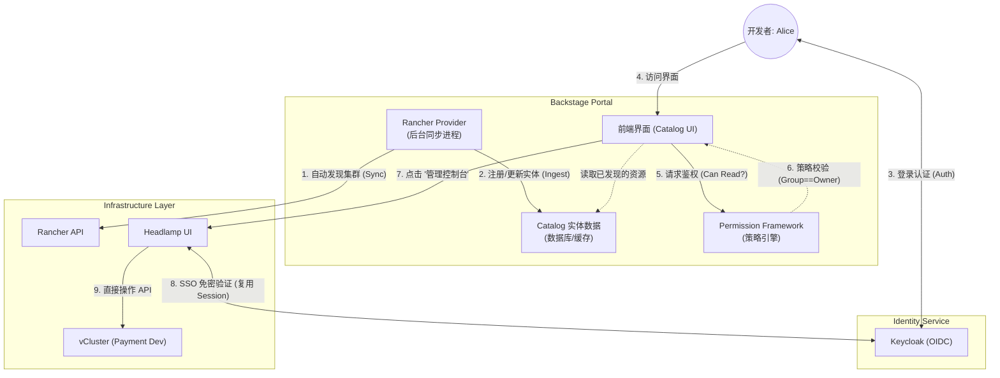

# **云原生多租户平台服务发现与隔离方案 (Phase 3\)**

**版本**: V1.1

**核心目标**: 实现资源的自动发现、可视化呈现，并基于身份实施严格的访问隔离。

## **1\. 核心设计哲学**

在前两个阶段，我们解决了“身份”和“资源交付”。本阶段关注“呈现与管控”。

1. **Visibility is Security (可见性即安全)**: 用户不应看到他们无权访问的资源。隔离不仅发生在 K8s 层面，更应发生在门户（Portal）层面。  
2. **Context Aware (上下文感知)**: 平台应根据当前登录用户的身份（Group），动态调整展示的内容和操作按钮。  
3. **Seamless Experience (无缝体验)**: 从“概览”到“深层管理”的跳转应当是连贯的，依赖统一的 OIDC 身份，而非多次登录。

## **2\. 发现与隔离架构图**



## **3\. 详细实施方案**

### **3.1 接入 Rancher 自动发现 (Discovery)**

虽然 Phase 2 通过 GitOps 注册了 catalog-info.yaml，但为了获取集群的实时连接信息（API Server URL, CA Data），我们需要 Rancher Provider。

* **配置目标**: 让 Backstage 能够连接到 Rancher 纳管的所有集群（包括 vCluster）。  
* **实施方式**:  
  1. 安装 @backstage/plugin-catalog-backend-module-rancher。  
  2. 配置 app-config.yaml:  
    ```yaml
    catalog:
      providers:
        rancher:
          dev-env:
            baseUrl: [https://rancher.your-domain.com](https://rancher.your-domain.com)
            token: ${RANCHER_TOKEN}
            # 关键：只同步 vCluster 类型的集群，避免污染目录
            clusterFilter: 'provider=k3s' 
    ```

  3. **数据融合**: GitOps 注册的实体（静态元数据）与 Rancher 发现的实体（动态连接信息）通过 metadata.name 或 annotation 进行关联。

### **3.2 配置权限过滤器 (Permission Framework)**

这是 Backstage 的核心安全机制。我们需要编写策略，拦截所有对 Catalog 的读取请求。

* **策略逻辑**:  
  * **Rule**: IS\_ENTITY\_OWNER  
  * **Condition**: 请求者的 claims.ownershipEntityRefs (所属组) 必须包含目标实体的 spec.owner。  
* **代码实现示例 (packages/backend/src/plugins/permission.ts)**:  
```typescript
import { createCatalogConditionalDecision } from '@backstage/plugin-catalog-backend/alpha';
import { PermissionPolicy, PolicyQuery } from '@backstage/plugin-permission-node';
import { BackstageIdentityResponse } from '@backstage/plugin-auth-node';
import { isCatalogEntityReadPermission } from '@backstage/plugin-catalog-common/alpha';

class MultiTenantPolicy implements PermissionPolicy {
  async handle(request: PolicyQuery, user?: BackstageIdentityResponse) {
    // 如果是读取 Catalog
    if (isCatalogEntityReadPermission(request.permission)) {
      // 如果没有登录用户，直接拒绝
      if (!user) return { result: 'DENY' };

      // 规则：允许读取属于自己团队的资源 (Owner 匹配)
      return createCatalogConditionalDecision(
        request.permission, 
        {
          anyOf: [
            {
              resourceType: 'catalog-entity',
              rules: [
                {
                  name: 'IS_ENTITY_OWNER',
                  arguments: { claims: user.identity.ownershipEntityRefs }
                }
              ]
            }
          ]
        }
      );
    }
    return { result: 'ALLOW' }; // 其他操作暂放行 (需按需收紧)
  }
}
```

### **3.3 展示 Headlamp 与 OIDC 透传**

当用户点击某个 vCluster 想要进行深度管理（如 Shell 进入 Pod、查看 Logs）时，跳转到 Headlamp。

* **前提**:  
  * Headlamp 与 Backstage 使用**同一个 Keycloak Realm**。  
  * vCluster 的 API Server 配置了 OIDC 参数 (Phase 2 已完成)。  
  * Headlamp 配置为 OIDC 登录模式。  
* **前端实现**:  
  在 Backstage 的 EntityPage.tsx 中，为 kubernetes-cluster 类型的实体添加跳转按钮。  
```typescript
// 动态生成 Headlamp URL
const headlampUrl = `https://headlamp.ops.com/c/${entity.metadata.name}`;

<Button href={headlampUrl} target="_blank" color="primary">
  Open Management Console
</Button>
```

* **体验流程**:  
  1. 用户在 Backstage (已登录, 有 Keycloak Session)。  
  2. 点击按钮跳转 Headlamp。  
  3. Headlamp 发现未登录，重定向到 Keycloak。  
  4. Keycloak 发现 Session 存在，**自动跳回** Headlamp (无需输入密码)。  
  5. Headlamp 获取 Token，携带 Token 访问 vCluster K8s API。  
  6. vCluster K8s API 验证 Token 签名与 RBAC (Phase 2 绑定的 cluster-admin)。  
  7. **验证通过，进入管理界面**。

## **4\. 开发指南 (Development Guide)**

### **4.1 插件依赖**

| 插件名称 | 作用 | 位置 |
| :---- | :---- | :---- |
| **@backstage/plugin-permission-backend** | 权限框架后端引擎 | Backend |
| **@backstage/plugin-catalog-backend-module-rancher** | Rancher 集群发现 | Backend |
| **@backstage/plugin-kubernetes** | (可选) 在 Backstage 直接展示简易 K8s 信息 | Frontend |

### **4.2 实施顺序**

1. **基础连接**: 配置 Rancher Provider，确保 Backstage 能看到集群列表。  
2. **链接打通**: 在 Catalog 页面添加 Headlamp 跳转链接，验证 OIDC SSO 是否丝滑。  
3. **权限收紧 (最后做)**: 开启 Permission Framework。  
   * *注意*: 刚开启时可能会导致所有人看不了任何东西，建议先在 handle 方法里写 console.log 调试，确认逻辑无误后再返回 DENY。

### **4.3 调试技巧**

* **Rancher ID vs Name**: Rancher API 返回的集群 ID 可能是 c-m-xxxxx，而你在 Phase 2 创建的 vCluster 名字是 payment-dev。需要确保 Headlamp 的 Context 命名规则与 Backstage 实体名称一致，或者在 Backstage 实体中添加 annotation 记录 Headlamp 的真实 URL。  
* **Token 作用域**: 确保 Keycloak 返回的 Token 包含 groups claim，这是 RBAC 鉴权的基础。