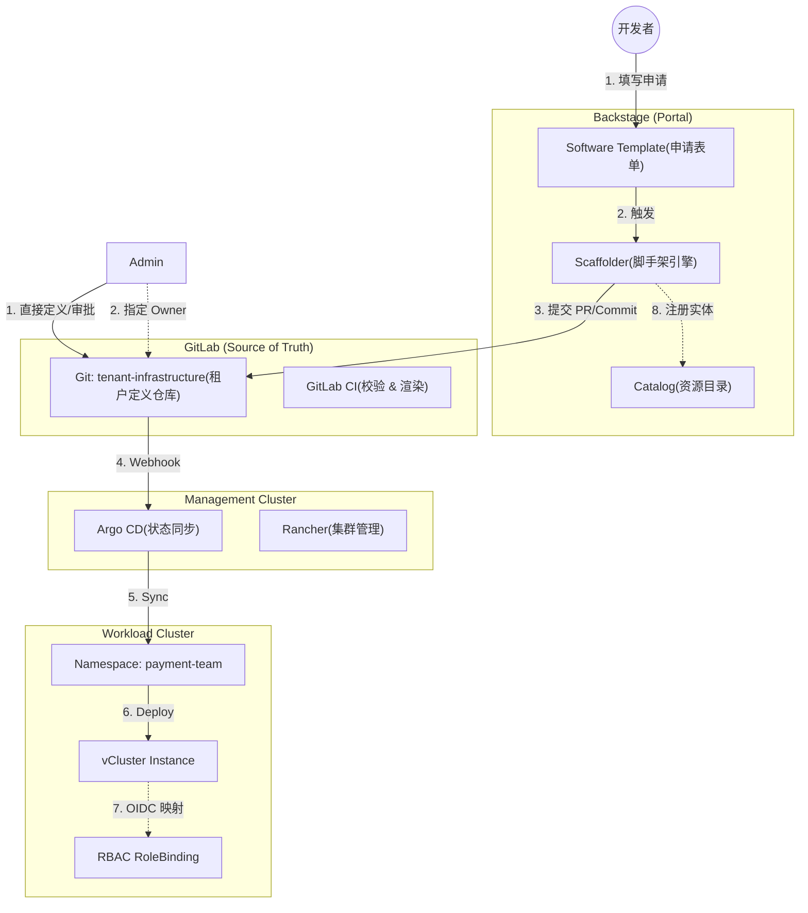

# **云原生多租户平台资源交付方案 (Phase 2\)**

**版本**: V1.2 (含具体开发实施方案)

**核心目标**: 实现 vCluster 的自助申请、自动化交付与权限归属闭环，达成“租户即代码”。

## **1\. 核心设计哲学**

在解决了“人是谁”的问题后，本阶段解决“人如何获取资源”的问题。

1. **Self-Service (自助服务)**: 开发者无需等待运维排期，通过门户自助申请环境。  
2. **Tenant as Code (租户即代码)**: 租户环境（vCluster）的定义、配额、权限全部由 Git 仓库中的 YAML 描述，而非手动操作。  
3. **Ownership First (归属权优先)**: 资源创建即确权。谁申请的、属于哪个团队，在创建时刻就写入元数据，杜绝“僵尸资源”。

## **2\. 交付架构全景图 (GitOps Flow)**

我们推荐采用 **Backstage \+ GitOps** 的模式，而不是让 Backstage 直接调用 Kubernetes API。这样做可以保留审计记录，并利用 Argo CD 的漂移检测能力。



## **3\. 详细实施方案**

### **3.1 Backstage 模板设计 (The Interface)**

这是用户交互的入口。我们需要定义一个 template.yaml，收集创建 vCluster 所需的必要信息，并自动注入上下文信息（如当前用户所属的 Group）。

* **输入参数**:  
  * clusterName: 环境名称 (如 dev-env-01)。  
  * size: 规格套餐 (Small/Medium/Large \- 对应不同的 ResourceQuota)。  
  * kubernetesVersion: K3s 版本选择。  
* **上下文注入 (关键)**:  
  * owner: 利用 Backstage 的 ${{ user.entity.relations.memberOf }} 自动获取申请人的团队，**禁止手动输入**，确保归属权真实。

### **3.2 自动化后端动作 (The Automation)**

Backstage 的 Scaffolder 不直接去 K8s 创建资源，而是去 **Git 仓库** 提交文件。

* **动作逻辑**:  
  1. 拉取 tenant-infrastructure 仓库。  
  2. 根据模板生成一个新的目录 tenants/\<team-name\>/\<cluster-name\>/。  
  3. 在该目录下生成 helm-release.yaml (Argo CD Application) 和 values.yaml (vCluster 配置)。  
  4. 生成 catalog-info.yaml 用于回写 Backstage 目录。  
  5. 提交代码并推送到 Git。

### **3.3 资源调配与 GitOps (The Provisioning)**

Argo CD 监听 Git 仓库的变化，发现新文件后，自动在目标物理集群执行以下操作：

1. **创建 Namespace**: 命名规则建议为 \<team\>-\<env\>。  
2. **创建 ResourceQuota**: 根据申请时的 size 参数，限制 CPU/Mem 配额。  
3. **部署 vCluster**: 安装 vCluster Helm Chart。

### **3.4 权限自动绑定 (The Security Binding)**

这是实现“只有支付团队能访问”的核心技术点。我们需要在创建 vCluster 时，配置其 API Server 的 OIDC 参数，并预置 RBAC 规则。

* **技术实现**:  
  * vCluster 支持透传宿主机的 OIDC 配置，或者独立配置 OIDC。  
  * **最佳实践**: 在 vCluster 的启动参数中配置 OIDC (指向 Keycloak)。  
  * **自动绑定**: 利用 Helm 的 post-install hook 或者 Argo CD 的同步特性，在 vCluster 启动后，自动创建 ClusterRoleBinding：  
    * **Subject**: Keycloak Group (e.g., /Engineering/Payment)  
    * **Role**: cluster-admin (vCluster 内部的管理员)

### **3.5 管理员交付与分配模式 (Admin Provisioning)**

除了开发者自助申请，管理员经常需要介入进行特殊资源的创建或重新分配。

* **场景**:  
  * 为新签约的 VIP 客户手动开通环境。  
  * 创建超出标准 Quota 的特殊测试环境。  
  * 将闲置的 vCluster 重新分配给其他团队。  
* **实施方式 (GitOps)**:  
  管理员不操作 UI，而是直接操作 **Git 仓库**。  
  1. **创建**: 管理员在 tenants/ 目录下复制一份标准配置，修改 values.yaml 中的资源配额（例如 limits.cpu: 100）。  
  2. **分配 (Assignment)**:  
     * 修改 values.yaml 中的 RBAC 绑定对象：
       ```yaml  
       subjects:  
       - kind: Group  
         name: "/Engineering/BigData" # 将管理员创建的集群指派给大数据团队
       ```
     * 修改 catalog-info.yaml 中的 Owner:
       ```yaml
       spec:  
         owner: big-data-team # 在 Backstage 中显示归属
       ```

  3. **生效**: 代码推送到 Git 后，Argo CD 自动同步，权限即刻转移。

## **4\. 落地步骤指南**

### **步骤 1: 准备基础 Helm Chart**

你需要定义一个“标准租户环境”的 Helm Chart (Umbrella Chart)，包含：

* vCluster (作为 Subchart)  
* Namespace 配置  
* ResourceQuota / LimitRange  
* NetworkPolicy (默认拒绝跨租户访问)  
* **RBAC Bootstrap Job** (用于初始化权限)

### **步骤 2: 编写 Backstage 模板**

在 software-templates 仓库中创建 vcluster-provisioner.yaml。

### **步骤 3: 配置 Argo CD**

创建一个 "App of Apps" 或者 ApplicationSet，指向你的 tenant-infrastructure 仓库，确保它能自动发现新文件夹并同步。

### **步骤 4: 联调验证**

1. 以 alice (Payment Team) 身份登录 Backstage。  
2. 填写表单申请 payment-dev。  
3. 观察 Git 仓库是否有新 Commit。  
4. 观察 Argo CD 是否开始同步。  
5. 观察 Rancher/K8s 是否出现 payment-dev 的 vCluster Pod。  
6. **核心验证**: Alice 使用 kubelogin 或 Headlamp 登录该 vCluster，验证是否拥有 Admin 权限。

## **5\. 示例代码 (Artifacts)**

### **5.1 Backstage Template (template.yaml)**
```yaml
apiVersion: scaffolder.backstage.io/v1beta3
kind: Template
metadata:
  name: create-vcluster
  title: 申请 vCluster 环境
  description: 为团队创建一个隔离的虚拟 Kubernetes 集群
spec:
  owner: platform-team
  type: service

  parameters:
    - title: 环境配置
      required:
        - name
        - size
      properties:
        name:
          title: 环境名称
          type: string
          description: 如 dev-01, feature-test
          ui:autofocus: true
        size:
          title: 资源规格
          type: string
          enum: [small, medium, large]
          default: small
    
    # 隐藏字段：自动捕获当前用户所属的组
    - title: 归属权确认
      properties:
        ownerGroup:
          title: 所属团队
          type: string
          ui:widget: hidden # 界面隐藏，自动填充
          default: ${{ user.entity.relations.memberOf[0] | parseEntityRef | pick('name') }}

  steps:
    - id: fetch-base
      name: 拉取配置模板
      action: fetch:template
      input:
        url: ./skeleton
        values:
          name: ${{ parameters.name }}
          owner: ${{ parameters.ownerGroup }}
          size: ${{ parameters.size }}

    - id: publish-git
      name: 提交到基础设施仓库
      action: publish:gitlab:merge-request
      input:
        repoUrl: gitlab.com?repo=tenant-infrastructure&owner=platform
        branchName: create-${{ parameters.ownerGroup }}-${{ parameters.name }}
        title: "Provision vCluster: ${{ parameters.name }} for ${{ parameters.ownerGroup }}"
        description: Auto-generated by Backstage

    - id: register-catalog
      name: 注册到目录
      action: catalog:register
      input:
        repoContentsUrl: ${{ steps['publish-git'].output.remoteUrl }}
        catalogInfoPath: '/tenants/${{ parameters.ownerGroup }}/${{ parameters.name }}/catalog-info.yaml'
```

### **5.2 租户定义文件 (values.yaml 生成示例)**

Backstage 提交到 Git 的最终文件内容示例：

```yaml
# tenants/payment-team/dev-01/values.yaml
vcluster:
  isolation:
    enabled: true
    # 限制该 vCluster 的资源使用
    resourceQuota:
      enabled: true
      quota:
        requests.cpu: 2
        requests.memory: 4Gi
        limits.cpu: 4
        limits.memory: 8Gi
  
  # 自动配置 OIDC 参数给 k3s/API Server
  syncer:
    extraArgs:
      - --tls-san=dev-01.vcluster.local
  
  # 关键：RBAC 初始化
  init:
    manifests: |-
      apiVersion: rbac.authorization.k8s.io/v1
      kind: ClusterRoleBinding
      metadata:
        name: team-admin-binding
      subjects:
      - kind: Group
        name: "/Engineering/Payment" # 对应 Keycloak Group
        apiGroup: rbac.authorization.k8s.io
      roleRef:
        kind: ClusterRole
        name: cluster-admin
        apiGroup: rbac.authorization.k8s.io
```

### **5.3 目录注册 (catalog-info.yaml)**

```yaml
apiVersion: backstage.io/v1alpha1
kind: Resource
metadata:
  name: vcluster-payment-dev-01
  description: Payment Team Dev Environment
  tags:
    - vcluster
    - k8s
  annotations:
    # 关联 ArgoCD 状态
    argocd/app-name: payment-dev-01
    # 关联 Rancher/Headlamp 跳转链接
    backstage.io/view-url: [https://headlamp.ops.com/c/payment-dev-01](https://headlamp.ops.com/c/payment-dev-01)
spec:
  type: kubernetes-cluster
  owner: payment-team # 核心：只有 payment-team 能在 Backstage 看到并操作
  dependsOn: []
```

## **6\. 具体开发与实施方案 (Development Guide)**

### **6.1 推荐插件与第三方库**

为了实现上述功能，您需要在 Backstage 项目中集成以下核心插件：

| 插件名称 | 作用 | 安装位置 | 备注 |
| :---- | :---- | :---- | :---- |
| **@backstage/plugin-scaffolder-backend-module-gitlab** | **\[核心\]** 提供 publish:gitlab 动作，允许 Backstage 向 GitLab 提交代码和创建 Merge Request。 | Backend | 必须配置 GitLab Token (Personal Access Token)。 |
| **@backstage/plugin-catalog-backend-module-gitlab** | 用于从 GitLab 自动发现 catalog-info.yaml 文件。 | Backend | 确保资源创建后能自动出现在 Backstage 列表中。 |
| **@backstage/plugin-argocd** | (可选) 在 Backstage 前端展示 Argo CD 的同步状态（Sync Status）。 | Frontend | 提升体验，让用户知道“环境正在创建中”。 |
| **loft-sh/vcluster (Helm Chart)** | 部署 vCluster 的标准 Chart。 | K8s/ArgoCD | 不要自己写 vCluster 的部署逻辑，直接引用官方 Chart。 |

### **6.2 开发与实施路径 (先做什么，后做什么)**

为了避免“牵一发而动全身”的调试困难，**强烈建议**按照以下依赖顺序进行开发：

#### **阶段 A: 底层资源定义 (Infrastructure First)**

**目标**：手动创建一个能跑通的“样板间”。

1. **编写 Umbrella Helm Chart**：创建一个名为 tenant-environment 的 Helm Chart。  
   * 在 Chart.yaml 的 dependencies 中引入 vcluster。  
   * 在 templates/ 中编写 ResourceQuota 和 NetworkPolicy 模板。  
2. **手动测试**：  
   * 手动编写一个 values.yaml。  
   * 执行 helm install test-env ./tenant-environment \-n test-ns。  
   * **验证**：vCluster 能起来吗？ResourceQuota 生效了吗？Admin 权限绑定对了吗？  
   * *只有这一步通了，后续的自动化才有意义。*

#### **阶段 B: GitOps 通路打通 (Pipeline Setup)**

**目标**：确保持久化仓库 (tenant-infrastructure) 能够驱动集群变化。

1. **初始化 Git 仓库**：创建 tenant-infrastructure 仓库。  
2. **配置 Argo CD**：  
   * 创建一个 ApplicationSet (App of Apps)。  
   * 指向 tenant-infrastructure 仓库的根目录或 tenants/\* 目录。  
3. **手动提交测试**：  
   * 手动把阶段 A 测试通过的 values.yaml 提交到 Git。  
   * 观察 Argo CD 是否自动同步并创建了环境。

#### **阶段 C: Backstage 自动化 (Template Development)**

**目标**：用 Backstage 替代“手动提交 Git”的动作。

1. **安装 Scaffolder Backend Module**：配置 GitLab 凭证。  
2. **编写 Skeleton (骨架文件)**：  
   * 将阶段 A 的 values.yaml 里的硬编码（如 payment-team, 2Gi）替换为变量（如 ${{ values.owner }}, ${{ values.memory }}）。  
   * 文件路径：skeleton/values.yaml.njk。  
3. **编写 Template.yaml**：  
   * 定义表单输入。  
   * 配置 fetch:template 和 publish:gitlab 步骤。  
4. **联调**：点击 Backstage 按钮，查看是否能在 Git 仓库生成正确的文件。

### **6.3 关键代码结构示例 (Skeleton Structure)**

在您的 Backstage templates/create-vcluster/skeleton 目录下，文件结构应该长这样：

```shell
skeleton/
├── .argo/                  # ArgoCD Application 定义 (可选，如果用 AppSet 可省略)
│   └── application.yaml
├── catalog-info.yaml       # 注册到 Backstage 的元数据
└── values.yaml             # 传给 Helm Chart 的配置
```

**skeleton/catalog-info.yaml 内容示例:**

```yaml
apiVersion: backstage.io/v1alpha1
kind: Resource
metadata:
  name: ${{ values.name }}
  description: vCluster for ${{ values.owner }}
  annotations:
    argocd/app-name: ${{ values.name }}
spec:
  type: kubernetes-cluster
  owner: ${{ values.owner }}
  dependsOn: []
```

**skeleton/values.yaml 内容示例:**

```yaml
# 这是传给 tenant-environment Chart 的配置
tenant:
  name: ${{ values.name }}
  owner: ${{ values.owner }}

quota:
  cpu: ${{ '4' if values.size == 'large' else '2' }}
  memory: ${{ '8Gi' if values.size == 'large' else '4Gi' }}

vcluster:
  # ... vcluster config ...
```
