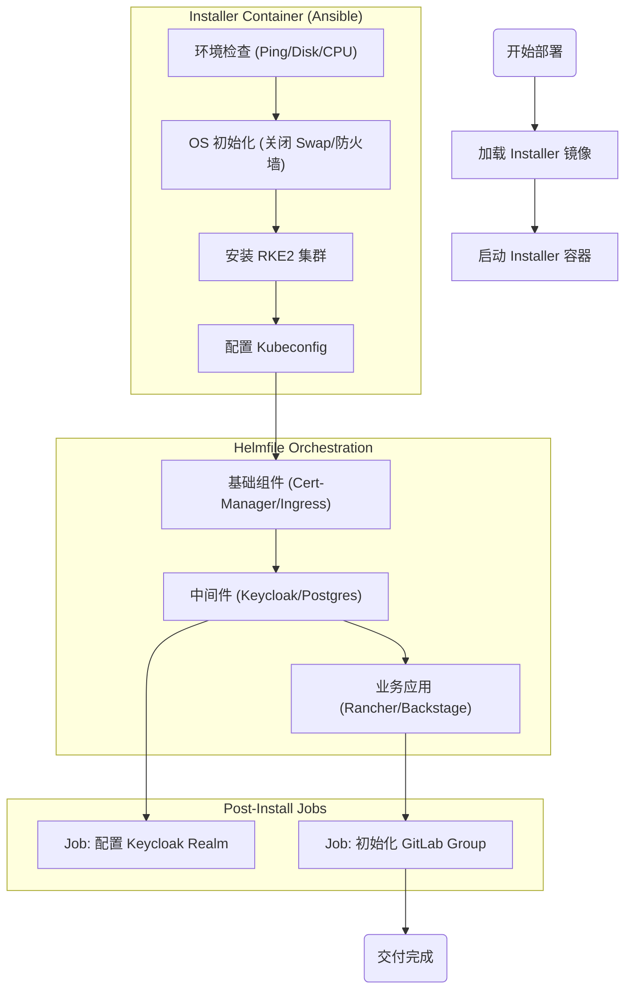

```mermaid
graph TD
    Start("开始部署") --> LoadImg["加载 Installer 镜像"]
    LoadImg --> RunCont["启动 Installer 容器"]
    
    subgraph "Installer Container (Ansible)"
        Check["环境检查 (Ping/Disk/CPU)"]
        InitOS["OS 初始化 (关闭 Swap/防火墙)"]
        InstallK8s["安装 RKE2 集群"]
        ConfKube["配置 Kubeconfig"]
        
        Check --> InitOS --> InstallK8s --> ConfKube
    end
    
    subgraph "Helmfile Orchestration"
        Base["基础组件 (Cert-Manager/Ingress)"]
        Middleware["中间件 (Keycloak/Postgres)"]
        Apps["业务应用 (Rancher/Backstage)"]
        
        ConfKube --> Base --> Middleware --> Apps
    end
    
    subgraph "Post-Install Jobs"
        ConfigKC["Job: 配置 Keycloak Realm"]
        ConfigGit["Job: 初始化 GitLab Group"]
        
        Middleware --> ConfigKC
        Apps --> ConfigGit
    end
    
    ConfigGit --> Finish("交付完成")
```

